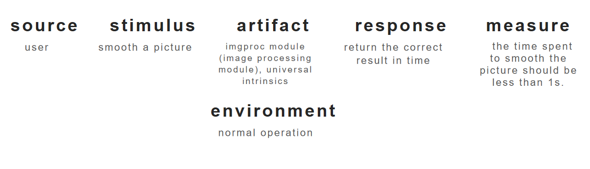
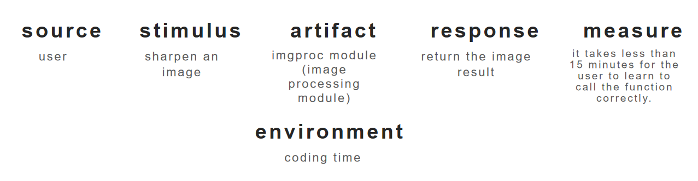
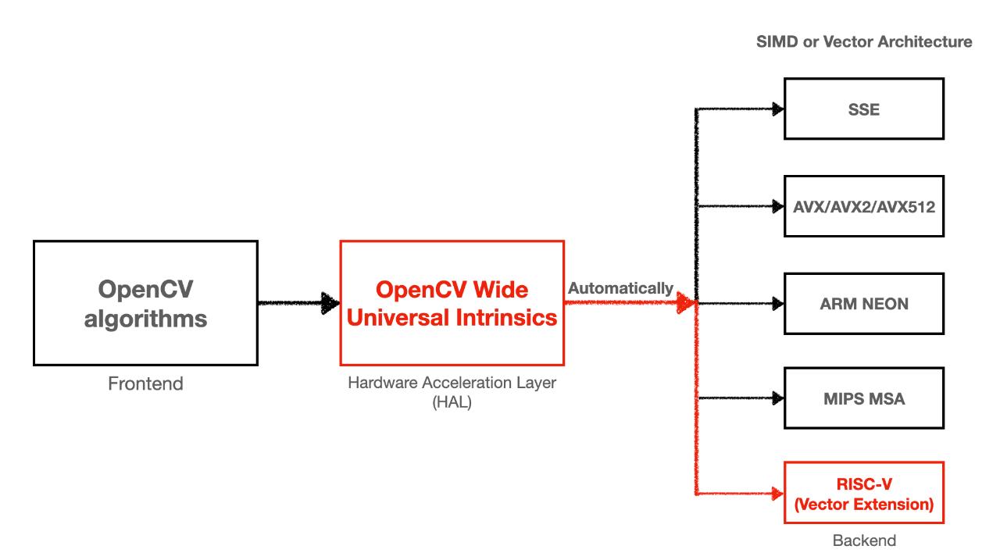
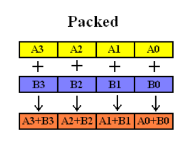
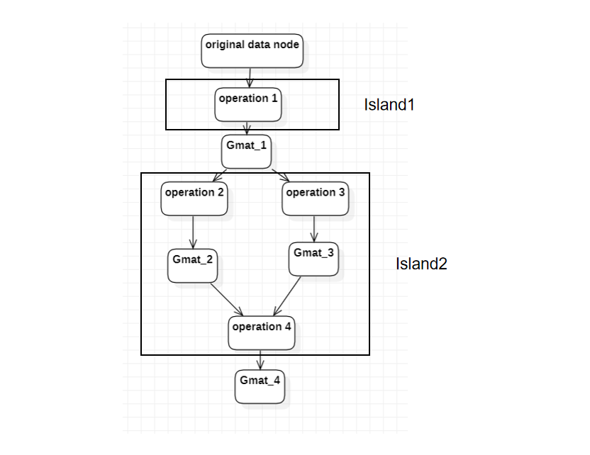
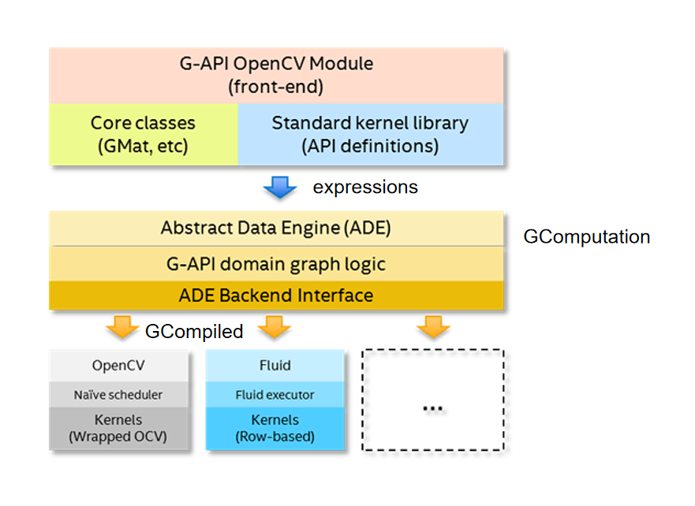

## <u>What is OpenCV?</u>

​	OpenCV stands for Open-Source Computer Vision (Library). It is the most common and popularly used, well-documented Computer Vision library. OpenCV is an open-source library that incorporates numerous computer vision algorithms. OpenCV increases computational efficiency and assists with real-time applications. One of the major goals of OpenCV is to provide an accessible and easy-to-use computer vision infrastructure that helps people build sophisticated computer vision applications quickly.

## <u>Features of OpenCV</u>

Main features of OpenCV-Python include:

1. **Cross-platform**: Allows installation for different environments (operating systems)
2. **Portable**: Transferable to any machine that can run C.
3. **Open source**: OpenCV is free for use under the open-source Apache 2 License.
4. **Fast**: OpenCV is highly optimized and makes use of NumPy functions.
5. **Vast algorithms**: OpenCV packages contain more than 2500 algorithms.
6. **Fast prototyping:** Implemented in the development of real-time applications.
7. **Extensive use**: Used across various organizations and companies.

## <u>Stakeholder And the Specific Concerns</u>

### User

​	The people who use openCV to develop machine vision application or study machine vision.

#### Main Concerns

1. Whether necessary functionality about machine vision is being delivered. 
2. Whether openCV is easy to use.
3. Whether openCV is high-performanced.

### Project Manager

​	Responsible for planning, sequencing, scheduling, and allocating resources to develop software components and deliver components to integration and test activities.

#### Main Concerns

1. Whether openCV can be delivered on time.
2. Whether openCV has efficient image processing capability.

### Tester

​	Creating tests based on the behavior and interaction of the software elements. 

#### Main Concerns

1. Whether openCV is correctly developed.

## <u>Context</u>

​	OpenCV was initiated at Intel in the year 1999 by Gary Bradsky. The first release of OpenCV came later in the year 2000. It was originally developed by Intel employees in a research center in Russia, but the project was taken over by a non-profit organization in 2012. OpenCV supports a multitude of Computer Vision and Machine Learning algorithms that are ever-growing.

​	In the initial stages of OpenCV, the goals of the company were as follows:

1. They sought to make advanced computer vision more accessible by providing open and optimized code for computer vision implementation.
2. The company aimed to essential open-source computer vision knowledge by providing a common platform that developers could build on, to make the code readily readable and transferable.
3. Deliver advanced commercial applications of computer vision by making portable and optimized code available for development. The OpenCV’s license provided the developers with the freedom to choose whether to open-source their product or not.

## <u>Quality attribute</u>

1. Usability . OpenCV supports a wide range of programming languages which include C++, Java, Python, etc. This is a cross-platform library that supports Windows, Linux, macOS, Android, and iOS.
2. Performance. OpenCV is a highly optimized library with focus on real-time applications.
3. Scalability. OpenCV now supports many algorithms related to computer vision and machine learning, and it is expanding every day.
4. Cross-platform. OpenCV has C++, Python and Java interfaces support Linux, MacOS, Windows, iOS, and Android.

## <u>Key Driver</u> 

1. Cross-platform

   ​	The key design idea is to keep pipeline code itself platform-neutral while specifying which kernels to use and which devices to utilize using extra parameters at graph compile (configuration) time.

2. Performance

   ​	 It plays a major role in real-time image processing and computer vision tasks which is a necessity for modern applications. OpenCV makes use of NumPy, which is a highly optimized python library for numerical computations. All of the OpenCV array structures are converted to and from NumPy arrays.

3. Usability

   ​	Users can use algorithm in openCV quickly and efficiently through calling function and giving parameters.

## <u>Early Decision</u> 

1. To make openCV Cross-platform,  openCV was written in C and this makes OpenCV portable to almost any commercial system.
3. OpenCV has many component: core, imgproc, object detection, features2d, calib3dstereo, and other modules. 
4. To make openCV easier to use, openCV design class MAT to achieve reference counting mechanism to automate memory management.

## <u>Technical Context</u>  

1. Usability. The lack of a computer vision library makes the development process require additional development.
2. Scalability. More and more computer vision algorithms have been proposed, which demands the scalability of the software. In commercial software, due to limitation of the interface, and it is difficult to expand flexibly according to the requirements.

## <u>Key Driver Scenario</u>

1. Performance

   source: user
stimulus: smooth a picture 
   environment: normal operation
artifact: imgproc module (image processing module), universal intrinsics
   response: return the correct result in time
response measure: the time spent to smooth the picture should be less than 1s.

2. usability 

   source: user
   stimulus:  sharpen an image
   artifact: imgproc module (image processing module)
   environment: coding time
   response: return the image result 
   response measure: it takes less than 15 minutes for the user to learn to call the function correctly.

## <u>**Architecture Tactics**</u>

1. Performance and Interoperability : Use concurrent and tailor interface

   ​	OpenCV has designed a uniform set of vector instructions(universal intrinsics), which can mask the differences between the different instruction sets. It allows you to write a piece of code for vector acceleration on different platforms and instruction sets. 

   ​	OpenCV Universal Intrinsic encapsulates the vectors (vector) of the different SIMD instructions into a unified data structure, overloading the various operators, and describes the vector width as a variable that automatically changes with the compiled environment. 

​	SIMD, aka single instruction multiple data, means that a once-run operational instruction can perform more than one data stream. For example, an addition instruction cycle can only calculate a set of numbers (one-dimensional vector addition). Using SIMD, an addition instruction cycle can calculate multiple data concurrently (n-dimensional vector addition), which greatly improves the operation efficiency.

2. Performance: Reduce Overhead 

   ​	OpenCV designed class GMat. Instead of storing the actual data, it records what the user does on the GMat and eventually combines multiple GMat to generate a computational graph to handle the real calculation. GMat can provide cross-function optimization that cannot be provided by decentralized functions internally, such as the merger of arithmetic operations, multiplexing of cache and avoid multiple allocation of buffers.

## **<u>Architecture Patterns</u>**

Layer Pattern

​	There are three layers in GAPI:

- **API Layer** – this is the top layer, which implements G-API public interface, its building blocks and semantics. When user constructs a pipeline with G-API, he interacts with this layer directly, and the entities the user operates on are provided by this layer. 
- **Graph Compiler Layer** – this is the intermediate layer which unrolls user computation into a graph and then applies a number of transformations to it. This layer is built atop of ADE Framework.
- **Backends Layer** – this is the lowest level layer, which lists a number of Backends. In contrast with the above two layers, backends are highly coupled with low-level platform details, with every backend standing for every platform. A backend operates on a processed graph (coming from the graph compiler) and executes this graph optimally for a specific platform or device.

​    The classes used for interaction between layers are as follows:

- **GComputation** class represents a captured computation graph. GComputation objects form boundaries for expression code user writes with G-API, allowing to compile and execute it.
- **GCompiled** represents a compiled computation (graph). Objects of this class actually do data processing, and graph execution is incapsulated into objects of this class. At the same time, two different GCompiled objects produced from the single GComputation are completely independent and can be used concurrently. 

​	The interaction procedure between the layers is as follows:

​	The user calls the function of the GAPI , which produces the expressions. These expressions will be passed to the Graph Compiler layer.

​	Initially, a bipartite graph is generated from expressions captured by API layer. This graph contains nodes of two types: *Data* and *Operations*. Graph always starts and ends with a Data node(s), with Operations nodes in-between. Every Operation node has inputs and outputs, both are Data nodes. This bipartite graph is saved by GComputation.

​	After the initial graph is generated, it is actually processed by a number of graph transformations, called *passes*. ADE Framework acts as a compiler pass management engine, and passes are written specifically for G-API. There are different passes which check graph validity, refine details on operations and data, organize nodes into clusters ("Islands") based on affinity or user-specified regioning and more.

​	Result of graph compilation is a compiled object, represented by class GCompiled. GCompiled will be executed in Backends layer later.

​	The way graph executed is defined by backends selected for compilation. In fact, every backend builds its own execution script as the final stage of graph compilation process, when an executable  object is being generated.

